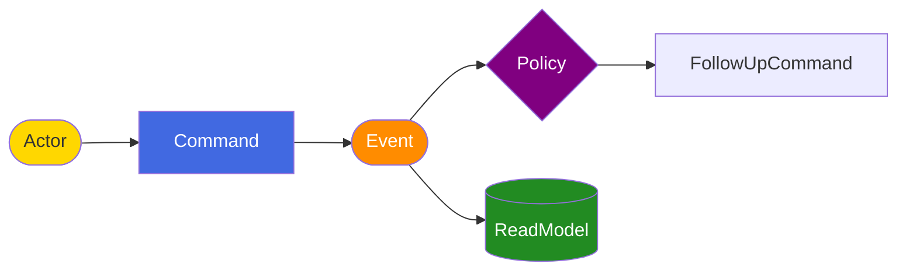

## Overview

<!-- Brief description of the flow being modeled, derived from event-storming -->

## Swim Lane Flows

<!-- One section per flow: Trigger -> Command -> Event -> Read Model -->

### Flow: <!-- flow name -->

| Lane | Detail |
|---|---|
| **Trigger** | <!-- human action or system signal --> |
| **Command** | <!-- operation name, domain context, business rules --> |
| **Event** | <!-- what occurred, data payload, ordering/dedup notes --> |
| **Read Model** | <!-- resulting projection, queries supported --> |

## Timeline Diagram (Mermaid)

## Downstream Handoff

- **Specs**: user stories to derive from these flows
- **Design**: broker, subject naming, payload formats to decide
- **AsyncAPI**: channels and message schemas to formalise
