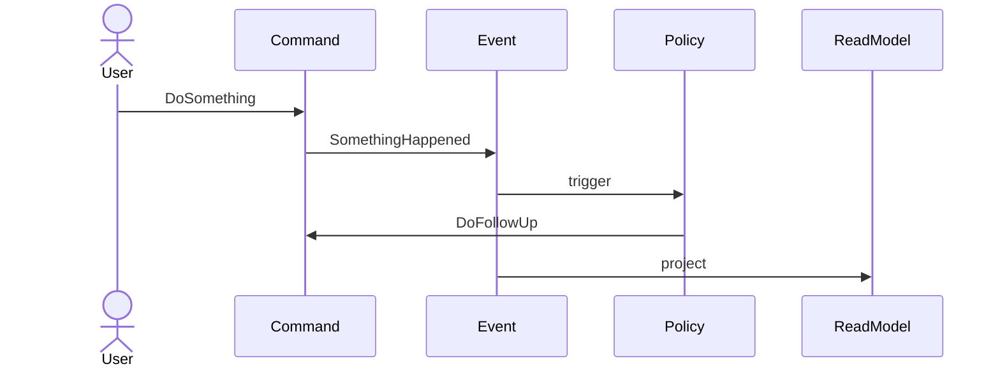

## Scope and Goal

<!-- Domain area, desired outcomes, and scope boundaries -->

## Actors

<!-- Primary users, external systems, and automated agents -->

## Domain Events (Past Tense)

<!-- Past-tense business facts with triggers, emitted data, and business impact -->

| Event | Trigger | Data Emitted | Business Impact |
|---|---|---|---|
| `<EventHappened>` | <!-- what caused it --> | <!-- payload fields --> | <!-- business meaning --> |

## Commands

<!-- Actions that trigger events -->

| Command | Issuer | Target | Preconditions | Expected Result |
|---|---|---|---|---|
| `<DoSomething>` | <!-- who issues it --> | <!-- aggregate/service --> | <!-- guard conditions --> | <!-- outcome --> |

## Aggregates / Bounded Contexts

<!-- Responsibilities, invariants, and owned data -->

## Automations / Policies

<!-- Event → Command chains -->

| Triggering Event | Emitted Command | Failure Handling |
|---|---|---|
| `<EventHappened>` | `<DoSomething>` | <!-- retry/dead-letter --> |

## Timeline Diagram (Mermaid)

## Hotspots and Open Questions

<!-- Ambiguities, risks, and decisions needed -->

## Handoff

- event-modeling.md: translate flows into swim lanes
- specs/: derive user stories from events and commands
- design.md: document broker, naming, payload decisions
- asyncapi.yaml: formalise channels and messages
